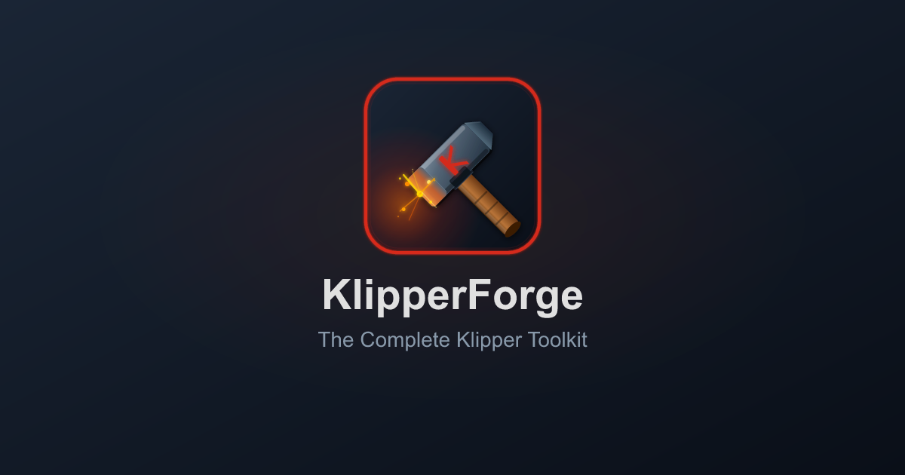

<p align="center">
  
</p>

<p align="center">
  The complete toolkit for <a href="https://www.klipper3d.org">Klipper</a> 3D printer firmware — configure, document, and compile.
</p>

<p align="center">
  <a href="https://klipperforge.andersevenrud.net/">Live Demo</a> · <a href="https://discord.gg/ygYWzq46">Discord</a>
</p>

---

> **Note:** KlipperForge is alpha software. Features may be incomplete, and data may contain errors. Always review generated configurations before flashing firmware or applying changes to your printer.

Generate complete, multi-file Klipper configurations through a split-view interface with interactive printer illustrations, live config preview, and a built-in code editor with syntax highlighting. Browse equipment documentation with specs, datasheets, and side-by-side comparisons. Compile firmware binaries directly in the browser through sandboxed Docker builds.

Select from a database of printers, MCU boards, equipment, and macros — or start from scratch and build your config section by section. KlipperForge validates your configuration in real-time, warns about missing fields, and shows how sections interact through overrides and pin assignments.

## Features

- Multi-file config generation with include directives
- Real-time validation and override detection
- Interactive PCB pin-out visualizations
- Built-in code editor with Klipper syntax highlighting and inline editing
- Printer preset database with per-model defaults
- Equipment library (fans, probes, sensors, stepper drivers, hotends, extruders)
- Equipment and component documentation with specs, datasheets, and side-by-side comparisons
- Interactive calibration guides with built-in calculators (PID tuning, pressure advance, flow rate, and more)
- G-code macro templates
- Browser-based firmware compilation via sandboxed Docker
- Import and export of existing Klipper configs
- Offline-first — runs entirely in the browser

## Requirements

- [Bun](https://bun.sh)

## Firmware builder

Firmware compilation runs through a pluggable adapter.

### Docker

The default. Builds run inside a sandboxed container with no network access and enforced memory, CPU, and pid limits.

- [Docker](https://www.docker.com) with the daemon running

### Host Process

Runs `make` directly on the host. Not sandboxed and only recommended for self-hosted deployments.

- `make`, `gcc`, `binutils`, `python3` (for Klipper's kconfig)
- `arm-none-eabi-gcc` / `arm-none-eabi-binutils` — STM32, SAM, RP2040, LPC176x
- `gcc-avr`, `avr-libc` — AVR boards (ATmega, AT90USB)
- `gcc-riscv64-unknown-elf` (or equivalent) — RISC-V boards (CH32V, HC32)

On macOS the Homebrew `arm-none-eabi-gcc` formula works; on Debian/Ubuntu the `gcc-arm-none-eabi`, `gcc-avr`, and `avr-libc` packages cover most targets. Refer to [Klipper's build docs](https://www.klipper3d.org/FAQ.html#how-do-i-upgrade-to-the-latest-software) for the authoritative list.

## Setup

```bash
bun install
bun run dev
```

Open http://localhost:5173

See [docs/contributing.md](docs/contributing.md) for development commands and conventions.

## Documentation

- [Architecture](docs/architecture.md)
- [Deployment](docs/deployment.md)
- [Contributing](docs/contributing.md)
- [Adding Definitions](docs/adding-definitions.md)

## Configuration

Each app has its own `.env` for local development. The repo-root `.env` is only consumed by Docker Compose.

- `apps/klipperforge/.env` — frontend feature flags
- `apps/firmware/.env` — firmware build server (adapter, Docker, cache, rate limits)
- `apps/configs/.env` — config storage server (GitHub OAuth, session, quotas)
- `.env` (repo root) — Docker Compose orchestration only

See the accompanying `.env.example` files for available options. When running via `docker compose up`, the root `.env` is passed through to containers — the per-app `.env` files are not read inside containers.

## Built with Claude Code

This project was built collaboratively with [Claude Code](https://claude.com/claude-code).

### Documentation Sources

Equipment documentation, specifications, and images are primarily sourced from official manufacturer materials. Where official sources were incomplete, third-party and community references were used to fill gaps — these are noted where applicable. Information from non-official sources may contain inaccuracies. Interactive PCB pin-out layouts are created by hand using an internal tool.

## License

[GNU General Public License v3.0](LICENSE)
